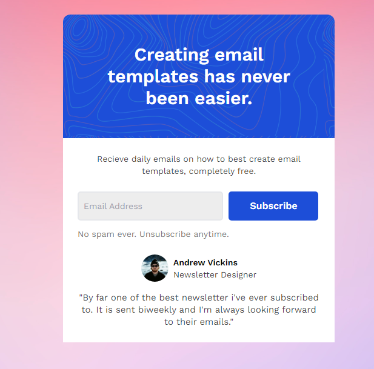

# Codewell - Newsletter Popup Template solution

This is a solution to the [Newsletter Popup Template challenge on Codewell](https://www.codewell.cc/challenges/newsletter-popup-template--60a8db35203a0e6180bb5035). Codewell challenges help you improve your coding skills by building realistic projects.

## Table of contents

- [Overview](#overview)
  - [The challenge](#the-challenge)
  - [Screenshot](#screenshot)
  - [Links](#links)
- [My process](#my-process)
  - [Built with](#built-with)
- [Author](#author)

## Overview

### The challenge

Users should be able to:

- View the optimal layout for the site depending on their device's screen size
<!-- - See hover states for all interactive elements on the page
- Filter job listings based on the categories -->

### Screenshot

### Links

- Solution URL: [https://www.codewell.cc/challenges/newsletter-popup-template--60a8db35203a0e6180bb5035/solution/626c2d3df41d4c4a88042247](https://www.codewell.cc/challenges/newsletter-popup-template--60a8db35203a0e6180bb5035/solution/626c2d3df41d4c4a88042247)
- Live Site URL: [https://sanketcharanpahadi.github.io/newsletter-popup-template/](https://sanketcharanpahadi.github.io/newsletter-popup-template/)

## My process

### Built with

- Semantic HTML5 markup
- CSS custom properties
- Flexbox
- Mobile-first workflow
- [Tailwind CSS](https://tailwindcss.com/) - CSS library

## Author

<!-- - Website - [Add your name here](https://www.your-site.com) -->
<!-- - Frontend Mentor - [@yourusername](https://www.frontendmentor.io/profile/yourusername) -->

- Twitter - [@SanketK86551440](https://www.twitter.com/SanketK86551440)
